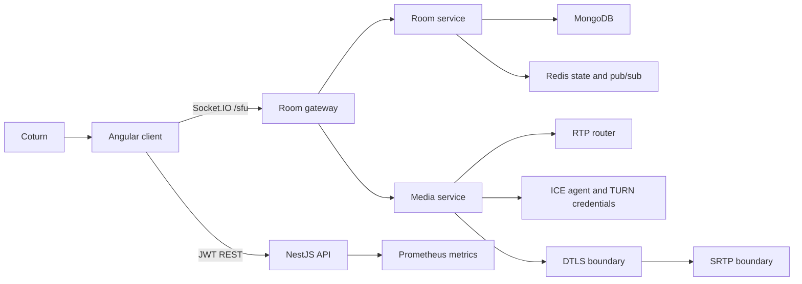
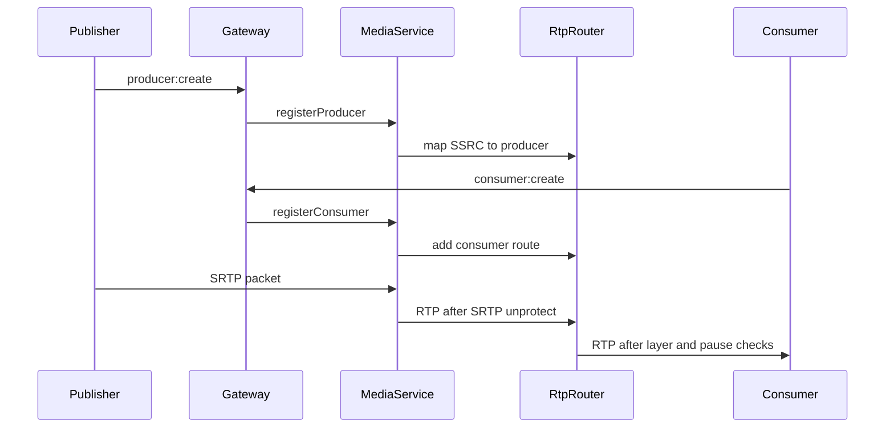

# Architecture

The platform is split into a control plane and a media plane.

## Control Plane

- REST handles authentication, room inspection, recording control, health checks, TURN credentials, and metrics.
- Socket.IO handles low-latency room actions, producer/consumer lifecycle, permission changes, moderation, chat, and hand raise state.
- MongoDB persists users, rooms, participants, producers, consumers, permissions, moderation records, chat messages, and recordings.
- Redis stores presence, distributed state cache, and pub/sub hooks for horizontal gateway scaling.

## Reusable Packages

- `@native-sfu/contracts` contains shared API and signaling contracts.
- `@native-sfu/sfu-core` is framework-free and owns RTP/RTCP parsing, packet routing, simulcast layer selection, bandwidth estimation, and audio-level observation.
- `@native-sfu/nest-sfu` wraps `sfu-core` for NestJS with a configurable ICE agent, TURN credential generation, fail-closed DTLS/SRTP boundaries, and a reusable `MediaService`.

## Media Plane

The router forwards RTP packets only. It does not mix, decode, encode, transcode, or compose media.

## Scaling

- API and gateway pods are stateless except for in-process media route tables.
- Redis presence/pubsub is the cross-pod coordination layer.
- MongoDB is the durable source of truth.
- Media routing requires participant affinity to the pod that owns a transport. In Kubernetes, use sticky routing for Socket.IO and a media-aware scheduler before running multi-pod media egress in production.
