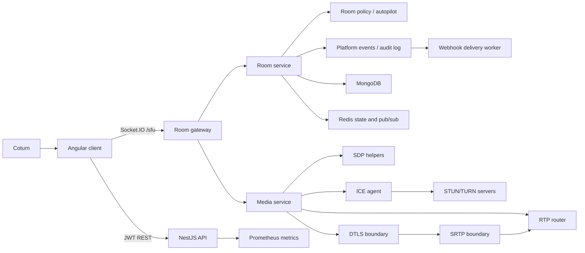
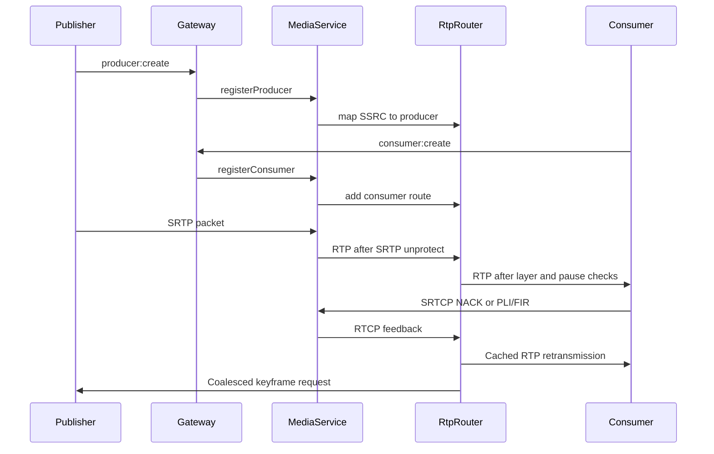

# Architecture

The platform is split into a control plane and a media plane.

## Control Plane

- REST handles authentication, room inspection, recording control, health checks, TURN credentials, and metrics.
- Socket.IO handles low-latency room actions, producer/consumer lifecycle, permission changes, moderation, chat, hand raise state, and live room-profile / quality-summary propagation.
- MongoDB persists users, rooms, participants, producers, consumers, permissions, moderation records, chat messages, recordings, platform events, webhook endpoints, and webhook delivery history.
- Redis stores presence, distributed state cache, and pub/sub hooks for horizontal gateway scaling.
- The room service now owns a policy layer that maps room media profiles to admission protection, default layer preferences, and producer / consumer priority weighting.
- `PlatformEventsService` adds an append-only event log and webhook-delivery queue without changing the existing room, media, or signaling ownership boundaries.

## Reusable Packages

- `@native-sfu/contracts` contains shared API and signaling contracts.
- `@native-sfu/sfu-core` is framework-free and owns RTP/RTCP parsing, packet routing, retransmission cache/NACK recovery, PLI/FIR aggregation, simulcast layer selection, bandwidth estimation, and audio-level observation.
- `@native-sfu/nest-sfu` wraps `sfu-core` for NestJS with a configurable ICE agent, STUN/TURN candidate gathering, TURN credential generation, DTLS transport establishment, SRTP/SRTCP protection, SDP helpers, RTCP processing, live media packet bridging, and a reusable `MediaService`.

## Media Plane

The router forwards RTP packets only. It does not mix, decode, encode, transcode, or compose media.

## Operator Autopilot

- Rooms persist a first-class media profile: `meeting`, `webinar`, `classroom`, or `support`.
- `RoomsService` combines the active profile, room quality state, node pressure, and worker pressure into a room quality summary.
- The summary drives live protection decisions for joins, new publishing, and optional screen-share starts.
- Hosts and co-hosts can change the room profile during an active session; the backend reapplies producer priorities and consumer default layer preferences without restarting the room.
- Operator incident snapshots are exported through the media diagnostics controller for room-scoped and transport-scoped debugging.

## Operator Incident Workflow

- Room incident state is persisted alongside the room document so protection, recovery, alert, and snapshot state survive reconnects.
- Timeline events and snapshot bundle summaries are stored separately for operator history and evidence capture.
- `RoomsService` is the single place that derives:
  - current incident state
  - alert lifecycles
  - workflow recommendations
  - automatic snapshot generation on critical transitions or room failure
- `RoomsGateway` streams incident updates over Socket.IO through the same distributed room-signal path used for quality and producer/consumer state.
- The Angular room shell consumes:
  - `room:incident-updated`
  - `room:incident-event`
  - `room:snapshot-generated`
  and renders them in the host controls surface as a first-class operational workflow.

## Eventing and Auditability

- The platform event log is broader than the room incident timeline:
  - incident timeline = room-incident and recovery story
  - platform event log = room, moderation, producer, consumer, recording, recovery, and operator control history
- `RoomsService`, `MediaController`, and `RecordingsService` emit platform events from the existing owner-authoritative runtime actions rather than from a synthetic mirror path.
- Webhook endpoints are stored as operator-managed documents with:
  - subscribed event types
  - optional room filters
  - per-endpoint retry policy
  - encrypted signing secret material
  - rolling health summary
- Delivery records are append-only and capture:
  - queued / retrying / delivered / exhausted / cancelled state
  - attempt count
  - last response code
  - last error
  - replay ancestry
- Delivery replay re-enters the real queue and signer path instead of bypassing normal delivery behavior.

## Scaling

- API and gateway pods are stateless except for in-process media route tables.
- Redis presence/pubsub is the cross-pod coordination layer.
- MongoDB is the durable source of truth.
- Platform events and webhook delivery history are safe for distributed room flows because emission stays on the existing owner-authoritative control path and persists into the shared database.
- Media routing requires participant affinity to the pod that owns a transport. In Kubernetes, use sticky routing for Socket.IO and a media-aware scheduler before running multi-pod media egress in production.
